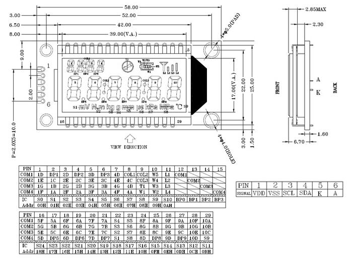

# PCF8576 segment LCD driver for Zephyr RTOS
  
# Introduction

This repository contains a configurable driver for the PCF8576 LCD driver IC. 
The IC is suitable for driving low segment count LCDs, e.g. displays 
that contains pictograms, bar graphs and numbers.

The major benefit of this driver is its high level API set that allows 
direct manipulation of LCD segment sets: 
* Individual single digit numbers
* Multi-digit numbers with decimal point
* Pictograms and symbols via their names
* Bar graphs like battery charge level indicator or progress bar

## Compatibility

The driver has been tested with Zephyr RTOS v 3.1.99 with the 
observation of future changes of v3.2.

## Hardware requirements

The driver requires I2C connection between the IC and the host CPU.

# Usage

In order to use the driver, the folders _dts_ and _lcd_ shall be included 
in your project. The lcd folder is a Zephyr _module_.

## Overlay files

The _application.overlay_ shall be tailored to your project's requirement 
and referred to in the CMakeLists.txt or its content to be included in your project's hardware definition.

The _lcd.overlay_ contains the definition of the LCD display itself. 
Details about the configuration of LCD in the next chapter.

## Changes in CMakelists.txt

The above changes can be sumarized by the two lines in the CMakelists.txt file of the project:

`list(APPEND ZEPHYR_EXTRA_MODULES  ${CMAKE_CURRENT_SOURCE_DIR}/lcd)`
`set(DTC_OVERLAY_FILE  "application.overlay lcd.overlay")`

# Configuration

## Enabling the driver

The driver's basic operation can be configured via Kconfig.
This includes options to enable/disable the driver.
The option can be accessed via Modules-->lcd-->LCD drivers

## Defining an LCD display

The definition of an LCD display is done via the file _lcd.overlay_.
An example configuration is attached that describes the LCD layout below:

### Definition of segments

Each new segment is defined individually with the term _segment_ that is a tuple of two integers:
The first is the Backplane Output index and the second one is the Segment index.
One arbitrary segment definition would look like:

`seg_1a: s1  { segment = <3 1>; };`

Where 
* _seg_1a_ is the unique label of the given segment, in this case the A segment of the 
first digit of a 7 segment number.
* _s1_ is an internal unique segment identifier
* _segment = <3 1>_ assigns this segment to BP3 and S1 pins of PCF8576.

### Definition of individual sign symbols

Sign symbols are LCD segments that van be turned on or off individually, 
These are typically small pictograms on the LCD.
These are defined under the "lcd-sign" compatibility class with the 
_sign_ keyword that refers to a segment definition, that we have provided for each 
segment in the previous chapter.
An example sign definition would look like:

`sign_defs:    sig  { compatible = "lcd-sign";` 
`sign_OK: sig1 { sign = <&seg_t1>;};` 
`};`

Where
* _sign_OK_ is the unique label of the sign that we can use later in the application
* _sig1_ is an internal unique ID of the sign
* _sign = <&seg_t1>_ defines a single segment symbol that links to the seg_t1 segment

### Definition of bar graph symbols

Bar graph symbols are a set of segments that typically indicates a proportional value.
This could be for example a battery percentage indicator or a value level indicator 
on the display.
The bar graphs are defined under the "lcd-bar" compatibility class with 
a set of segments each with the _bar_ keyword. Each segment of the bar graph refers back to the 
segment definition on the top of the lcd overlay file.

An example battery level bar graph definition would look like:

`bar_battery:  barbat { compatible = "lcd-bar";` 
`b1 { bar = <&seg_w1>;};` 
`b2 { bar = <&seg_w5>;};` 
`b3 { bar = <&seg_w4>;};` 
`b4 { bar = <&seg_w3>;};` 
`b5 { bar = <&seg_w2>;};` 
`};`

### Definition of individual digits (numbers)

It is possible to define individual 7-segment number digits with optional decimal 
point, that can be referred from the application as a single digit number.
Note that the current DTS supports only 7 segment numbers, so segmented 
alphanumeric symbols are not available at the moment.

The digits are defined under the _lcd-digit_ compatibility class, with each number 
consisting of a list of 8 segment references with the _digit_ keyword.

An example digit definition would look like:

`digit1:       d1   { compatible = "lcd-digit";` 
`digit = <&seg_1a &seg_1b &seg_1c &seg_1d &seg_1e &seg_1f &seg_1g &seg_1dp>;};`

### Definition of multi-digit numbers

It is possible to define numbers that are longer than a single digit. The application
can refer to these numbers with their symbolic name and the high level API can
write numbers directly. The numbers are defined under the _lcd-number_ compatibility
class with the _number_ 

An example multi-digit number would look like:

`num_4digs: num1 { compatible = "lcd-number";` 
`n1 {number = <&digit1>;};` 
`n2 {number = <&digit2>;};` 
`n3 {number = <&digit3>;};` 
`n4 {number = <&digit4>;};`
`};`

# API and usage

An example application is available in the file main.c that may help to 
identify the API an initialization.

## Getting the device control structure

The device struct can be acquired via the DEVICE_DT_GET api.
Example:

`const struct device *dev = DEVICE_DT_GET(DT_NODELABEL(lcd_drv));`

where lcd_drv is the name of the device in the application overlay file under 
the I2C peripheral definition part.

## Symbol definition in the application 

Complex multi-segment symbols shall be _declared_ and _defined_ in the application in order to 
get the required RAM buffers allocated and init state set.

### Definition of bar graphs

This shall be done via the pair of pcf8576_bar_declare(_label_) and 
pcf8576_bar_define(_label) macros, where _label_ is the bar symbol name.

### Definition of numbers

This shall be done via the pair of pcf8576_num_declare(_label_) and
pcf8576_num_define(_label) macros, where _label_ is the number symbol name.

## pcf8576_flush(void) (function)

The _pcf8576_flush()_ API call would perform a burst write from the RAM mirror of 
the driver to the internal RAM of the PCF8576 device. This is needed to 
refresh the LCD content after it has been changed by APIs that have manipulated 
the segment values.

## pcf8576_num(struct device *dev, _label_, float value) (macro) 

The _pcf8576_num_ API call can convert the floating point _value_ parameter
to the format matching the 7-segment number definition and set the symbol identified by the _label_ to 
this value.

## pcf8576_bar(struct device *dev, _label_, size_t value) (macro)

The _pcf8576_bar_ API call can set the _value_ number of segments of a bar graph to ON, 
and the rest to OFF.

## pcf8576_sign(struct device *dev, _label_, bool value) (macro)

The _pcf8576_sign_ API call can set the sign referred with the _label_ to 
ON, if _value_ is true and OFF if _value_ is false.

# Demo application

There is a demo application included in src folder. It is tailored to a
given LCD layout that is depicted above. It implements an up and a down counter display, 
that are accessed via their symbolic name _num_large_ and num_small_ respectively.

The video below shows the expected operation of the LCD:

